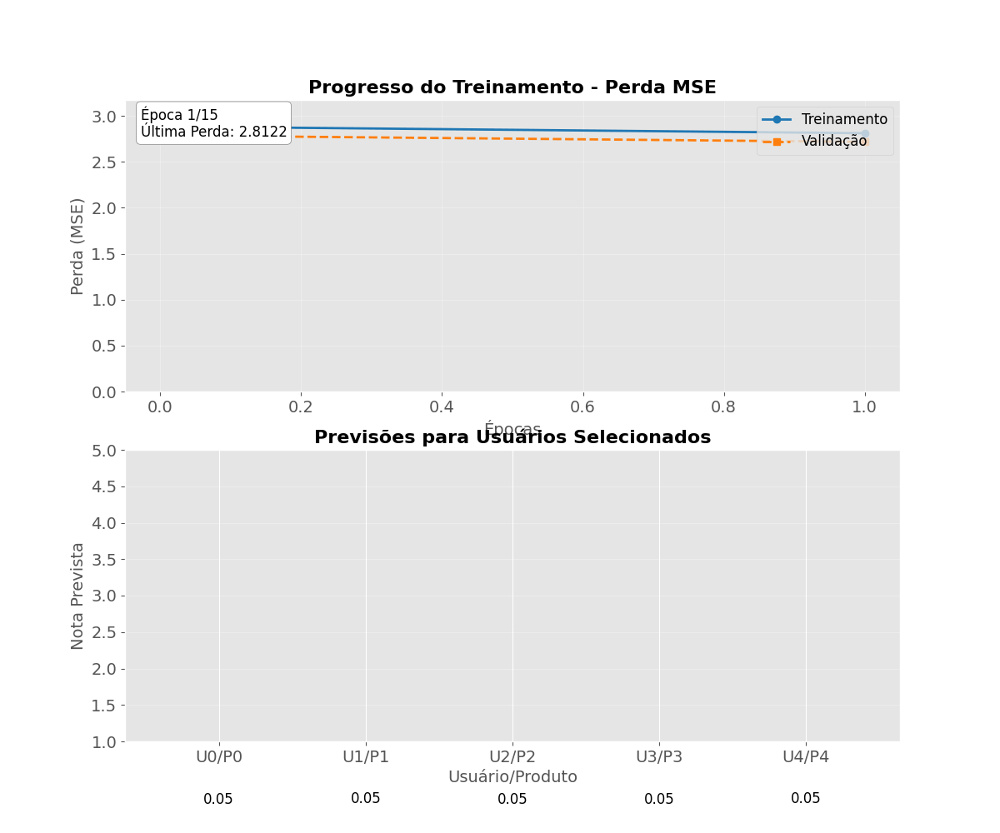

# Projeto_Recomendacao_Animacao

[](https://opensource.org/licenses/MIT)

## 🚀 Demonstração

Veja a animação gerada pelo projeto:

<p align="center">
  
</p>

## 📄 Descrição do Projeto

Este projeto demonstra a construção e o treinamento de um modelo de sistema de recomendação simples utilizando redes neurais com TensorFlow e Keras. O principal diferencial deste repositório é a visualização interativa do processo de treinamento, onde uma animação é gerada para mostrar em tempo real a evolução da perda (loss) e as previsões do modelo ao longo das épocas.

O modelo utiliza a técnica de *embedding* para representar usuários e produtos em um espaço vetorial de baixa dimensão. As previsões de notas são baseadas no produto escalar (*dot product*) entre os vetores de embedding de um usuário e de um produto, seguidas por uma camada densa final. Dados sintéticos são gerados para simular um cenário de interações de usuários com produtos.

### ⚙️ Estrutura do Repositório

Certifique-se de que a estrutura de pastas do projeto esteja correta:
```
Projeto_Recomendacao_Animacao/
    ├── media/
    │   └── recomendacao_animacao_impactante.gif
    ├── notebooks/
    │   └── recomendacao_animacao.ipynb
    ├── .gitignore
    ├── LICENSE.md
    ├── README.md
    └── requirements.txt
```

## 🚀 Como Executar

1.  Clone este repositório:
    ```bash
    git clone [https://github.com/flaviohenriquehb777/Projeto_Recomendacao_Animacao.git](https://github.com/flaviohenriquehb777/Projeto_Recomendacao_Animacao.git)
    cd Projeto_Recomendacao_Animacao
    ```
2.  Crie um ambiente virtual e instale as dependências necessárias:
    ```bash
    python -m venv venv
    source venv/bin/activate  # No Windows, use `venv\Scripts\activate`
    pip install -r requirements.txt
    ```
3.  Abra e execute o notebook `recomendacao_animacao.ipynb` em seu ambiente de desenvolvimento preferido (Jupyter, VS Code, etc.). O notebook irá gerar e salvar a animação do treinamento na pasta `media/`.

## 💻 Tecnologias Utilizadas

* **Python 3.x**: Linguagem de programação principal.
* **TensorFlow**: Framework de aprendizado de máquina para a construção do modelo.
* **Keras**: API de alto nível do TensorFlow para a criação e treinamento do modelo.
* **NumPy**: Biblioteca para manipulação de arrays e geração de dados sintéticos.
* **Matplotlib**: Biblioteca para a criação dos gráficos e da animação.
* **Pillow**: Biblioteca utilizada pelo Matplotlib para salvar a animação em formato GIF.

## 📈 Análise da Animação

A animação `recomendacao_animacao_impactante.gif` é a peça central deste projeto. Ela é dividida em dois painéis:

* **Gráfico Superior**: Mostra a evolução da perda de treinamento (em azul) e da perda de validação (em laranja) ao longo das épocas. A perda decrescente indica que o modelo está aprendendo a fazer melhores previsões.
* **Gráfico Inferior**: Exibe as notas previstas para um conjunto fixo de pares (usuário, produto) a cada época. É possível observar como essas previsões se ajustam gradualmente à medida que o modelo otimiza seus *embeddings* para minimizar a perda.

Essa visualização dinâmica é uma ferramenta poderosa para entender o processo de treinamento de modelos de *embedding* e validação, oferecendo uma percepção intuitiva sobre como o modelo converge para uma solução.

## 📄 Licença

Este projeto está licenciado sob a Licença MIT - veja o arquivo [LICENSE.md](LICENSE.md) para mais detalhes.

## 📧 Contato

Se você tiver alguma dúvida ou sugestão, entre em contato:

* **Nome**: Flávio Henrique Barbosa
* **LinkedIn**: [Flávio Henrique Barbosa | LinkedIn](https://www.linkedin.com/in/fl%C3%A1vio-henrique-barbosa-38465938)
* **Email**: flaviohenriquehb777@outlook.com